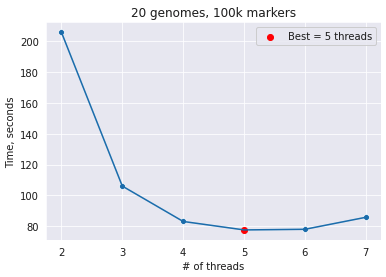

# Genetic Marker Search

This is a project we completed as a part of our "Parallel Programming in C++" course at Ukrainian Catholic University. 

We solve a problem of finding whether any of a given set of genetic markers are present in given genome sequences. In fact, this is an application of string matching problem, so it can be solved using a classic algorithm like [Aho-Corasick](https://en.wikipedia.org/wiki/Aho%E2%80%93Corasick_algorithm).

Our main goal was to implement an efficient parallel implementation, since the project owner has really large amount of genome files and wishes to utilize their multi-core machine. With this in mind, we decided to use CPU-thread-based parallelism. 

The main matching part is designed as a producer-consumer pipeline, with one thread loading the genomes from the drive and storing them into a bounded queue (in order not to run out of memory), and multiple threads performing string matching. For threading, we chose `std::thread` and for efficient communication between threads we use concurrent data structures from Intel's `TBB`. 

## Usage

After building the project, navigate to the folder with the executable and run:
```bash
./run_search CONFIG_FILE
```
`CONFIG_FILE` must be a valid config file, like [this](https://gist.github.com/lekhovitsky/ef19c047d1520ea6d45c715795fde06d), which specifies the following values:
- `genomes_path`: path to a folder with genome files (either `.fasta` files or archives containing a single `.fasta` file each).
- `markers_file`: path to a `.csv` file with markers to find in genomes.
- `result_file`: path to a `.csv` file to store the result at.
- `num_threads`: number of parallel workers (must be at least 2).
- `max_queue_size`: the maximum number of genomes to keep in memory at the same time. Set this based on your RAM restrictions. For example, each `.fasta` file we use is around 120MB, and contains 5 genomes. So if we don't want the genomes to take more than, say, 1.2GB of memory, we should set `max_queue_size` to 1200 / 120 * 5 = 50.
- `verbose`: set to 1 to display progress and status messages and to 0 otherwise.

The result is a CSV file with genome IDs as rows, marker IDs as columns, and 1's or 0's on the intersetion representing whether a given marker is found in a given genome.

## Data

Pseudogenomes data that we used for testing can be found [here](https://1001genomes.org/data/GMI-MPI/releases/v3.1/pseudogenomes/fasta/). We've prepared a script `load_genomes.py` to load the required number of files. To load `NUM_FILES` files and store them at `DEST_DIR`, execute
```bash
./load_genomes.py DEST_DIR --n NUM_FILES
```
Every loaded file is a `.gz` archive containing one multi-FASTA file.


Unfortunately, markers we used are not available for public use, but we provide a `sample_markers.csv` [file](https://gist.github.com/lekhovitsky/72744a626b610d10153d71ee44d0927e) with random markers for basic testing.

## Dependencies

The program mostly relies on basic C++ 17 functionality, but uses some third-party libraries. Particularly, `boost` is used for various file manipulations, and Intel's `TBB` for efficient concurrent data structures. Including `TBB` into the project might be tricky on certain systems, so we provide a `FindTBB.cmake` file (not our work) which solves this problem.

Our implementation of Aho-Corasick turned out to be not very efficient, so we replaced it with [this](https://github.com/cjgdev/aho_corasick) one. We did small adjustments to make it work in parallel manner. 

## Performance

The first test is comparison of execution time of C++ and pure-Python (`ahocorapy`) Aho-Corasick implementations. We divide the main part of execution into two stages: building a trie (not parallelizable) and matching a text (parallelizable). This test allows us to estimate the upper-bound of parallelization speed-up.

Since we have genomes of different size, we take an average matching time of 5 genomes. Also, we run the test for different numbers of markers. Source code of the benchmarks is stored at `benchmarks` directory. 

The results on Intel Core i5 7200U CPU @ 2.5GHz with `num_threads=4` are the following (min across multiple runs): 

| # markers  |  trie (ahocorapy)  | trie (C++) | matching (ahocorapy) |  matching (C++)  |
|--------:|------:|-------:|------:|------:|
|    10^3 | 0.06s |  0.02s | 29.2s |  5.8s |
|    10^4 | 0.45s |  0.13s | 33.9s |  6.8s |
|    10^5 | 4.44s |  1.36s | 39.9s |  9.7s |
|    10^6 | 80.0s |  22.8s | 50.0s | 13.4s |
|2 * 10^6 |       |  48.8s |       | 14.2s |
|3 * 10^6 |       |  77.0s |       | 14.9s |

The second test is measurement of the effect of parallelization by running the main executable on different numbers of hardware threads. On the same machine, we ran the `run_search` program on 20 fasta files (100 genomes) and 1M markers. 

With `num_threads=2` and `max_queue_size=5` (effectively, one thread for reading genomes and one thread for matching), we get
```
Reading markers:  8.335 seconds
Building trie:    24.678 seconds
Matching genomes: 1569.967 seconds
Saving results:   12.939 seconds
```

With `num_threads=4` and `max_queue_size=10` (one thread for reading and three threads for matching), we get
```
Reading markers:  8.327 seconds
Building trie:    27.877 seconds
Matching genomes: 616.065 seconds
Saving results:   16.117 seconds
```

As expected, we see x2.5 speed-up in parallelizable section of the program, which almost reaches the ideal x3 increase in performance.

Also, we did this test for a smaller amount of genomes but for a wider range of `num_threads` values to determine the optimal number of threads:



The final test was made for comparison with other teams doing this project and represents a **complete** run on 1000 genomes (200 files) and 3M markers (_uses our older implementation of Aho-Corasick_). It was performed in Intel(R) Core(TM) i7-7820X CPU @ 3.60GHz with 8 cores and 16 hardware threads with `num_threads=16` and `max_queue_size=48`. The results are the following:

- Bulding trie: 105.6 seconds
- Matching markers 2520.3 seconds
- **Overall time**: ~43 minutes

## Possible optimizations:
- Aho-Corasick speed-up (remove overhead related to more detailed output format)
- Using more memory-efficient data types
- GPU parallelizations:
  - On a genom level
  - On a subgenom level
  - Trie build
